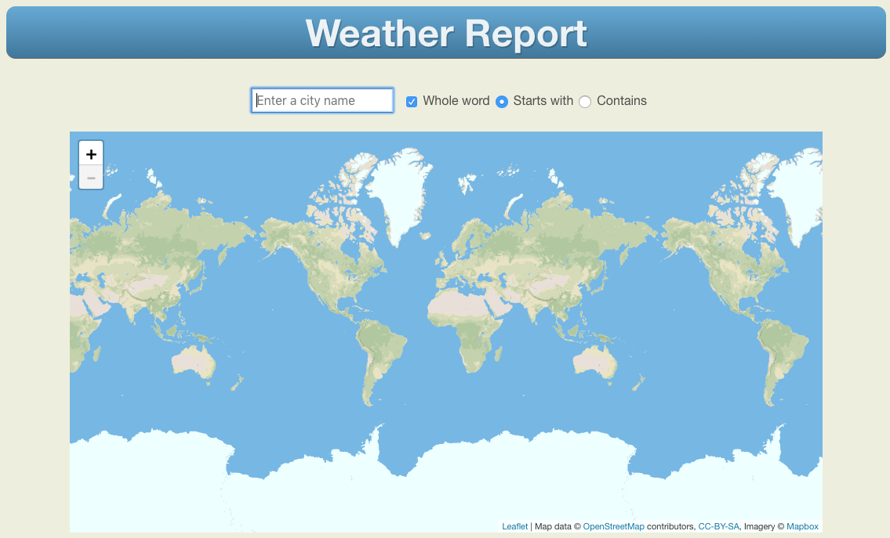

# Demo Weather Report App



## Purpose of this app
This Scala app is designed to demonstrate two things:

* The ease with which an interactive web app can be built using the Actor Model.
* The Cloud Foundry concept of "Bring your language"

## Overview

This app provides a weather report for any town or city worldwide having a population greater than 500.

## Technical Overview

This application is developed in [Erlang](http://www.erlang.org/) and uses the following open source frameworks: [OTP](http://erlang.org/doc/),  [Cowboy](https://ninenines.eu/) and [iBrowse](https://github.com/cmullaparthi/ibrowse)

The data supplied by this server is derived from a variety of sources:

| Type of Data | Source |
|---|---|
| Geographic & Geopolitical | [GeoNames.org](http://www.geonames.org) |
| Weather Forecast | [OpenWeatherMap](https://openweathermap.org/) |
| World Maps | [OpenStreetMap](https://openweathermap.org/) |


## But first, get yourself an API key...

Before describing how you can implement this app, you ***must*** first register with the [Open Weather Map](http://openweathermap.org) web site to obtain an [API Key](http://openweathermap.org/appid).

You must then edit the file `index.html` and insert your API Key as the second parameter to the JavaScript function `Weather.mail()` on line 54.  Without this API Key, this app will be unable to obtain any weather information.

Replace the string `"Please supply..."` with your actual API Key:

```javascript
// Start the user interface
Weather.main(browser_name, "Please supply your Open Weather Map API Key as the 2nd parameter to Weather.main()")

```

When you're finished, it will look something like this (this is not a genuine API Key BTW!):

```javascript
// Start the user interface
Weather.main(browser_name, "9f216739eda6ad5239fc221d8a0996cd")
```


## Assumption

The instructions below assume you already have a Cloud Foundry account on at least the SAP Trial landscape.  If this is not the case, please first create an account as per the [instructions here](https://help.sap.com/doc/65de2977205c403bbc107264b8eccf4b/Cloud/en-US/7da580474d654d96ad4d4fc05c778a18.html#loio7da580474d654d96ad4d4fc05c778a18).

## Delivery

This app has been packaged for delivery in two distinct ways:

### 1. For those with Scala development experience

For those people who are already experienced Scala developers, the source code for the entire IntelliJ project is contained within this repo.

Clone this repo onto your local machine and build using either:

1. `sbt fullOptJS` then launch using `index.html`
1. `sbt fastOptJS` then launch using `index-dev.html`

For development purposes, this app uses the ScalaJS add-on [Workbench](https://github.com/lihaoyi/workbench); therefore, if you wish to run this app locally, build it using `sbt ~fastOptJS` and point your browser to the [local webpage](http://localhost:12345/target/scala-2.12/classes/index-dev.html)

If you wish to see the runtime trace/debug information, then within each class or object there is a Boolean variable called `traceActive`.  Change this to `true`, recompile the app and you will then see that class or object's runtime output in the browser console.


### 2. For those with no Scala development experience

For those who have no Scala development experience, a compiled version of the project is available as a ZIP file that, once unzipped, can be deployed to Cloud Foundry using `cf push`.

Download the file `cf-weather-report.zip`, unzip it into some local directory, then follow the instructions for deployment to Cloud Foundry.


## Deployment to Cloud Foundry

1. Edit `manifest.yml` and change the name of the app to include your userid.  E.G. `- name:      <my_userid>-weather-report`
1. After saving your changes, open a command prompt and change into the directory containing `manifest.yml`.
1. If you have not already done so, set your Cloud Foundry API endpoint. For instance, if you have an account on the European (Frankfurt) server, then use the command:
    `cf api https://cfapps.eu10.hana.ondemand.com`
1. Log in to Cloud Foundry with `cf login` and supply your credentials
1. Push the application to your Cloud Foundry account using `cf push`.  If the push fails, check in the `manifest.yml` file that you have given the application a globally unique name.


## Implementation Details

This app is written in Scala using the [ScalaJS](https://www.scala-js.org/) and [Akka-Actor](https://akka.io/) frameworks.

See the presentation [Using the Actor Model](./documentation/Using%20the%20Actor%20Model.ppsx) in the documentation folder for both an overview of the Actor Model design concept, and a description of the application's internal architecture.
 
A running version of this app can be found deployed to my trial [Cloud Foundry](https://weather-report.cfapps.eu10.hana.ondemand.com/) account.
